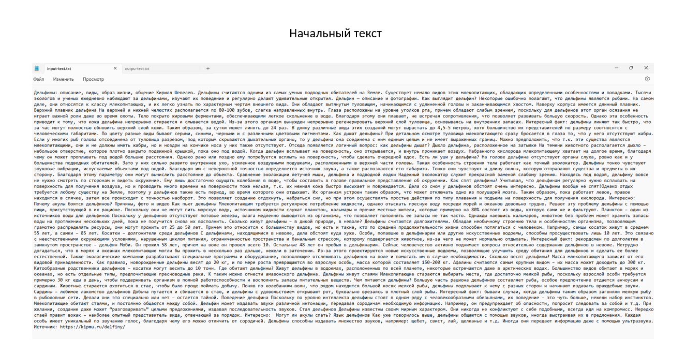
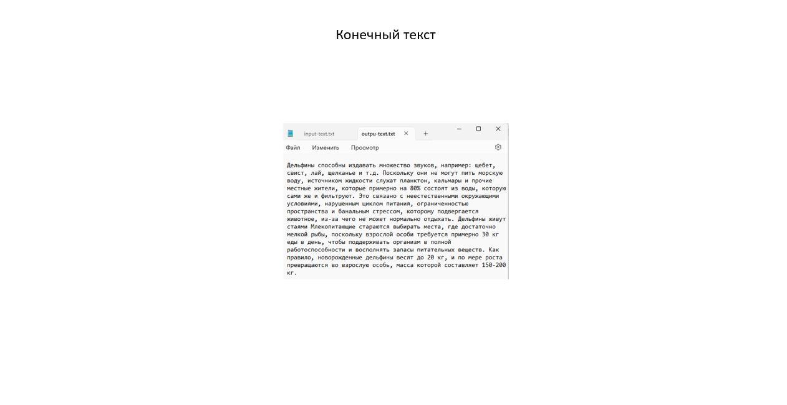

### Реализация алгоритма автореферирования текста ACSI-Matic

Этот алгоритм сначала создаёт таблицу слов. Для каждого слова он считает сколько раз оно встретилось во всём тексте

Затем, он проходит по предложениям, и для каждого предложения считает "Вес" - сумму значений, сколько раз встретилось слово, для каждого слова этого предложения

И далее он выбирает для конечного текста - первые несколько предложений, у которых вес получился наибольшим. Количество предложений можно выбрать (а в моей программе - также можно задать %)

Так данный алгоритм реферирует текст, выбирая самые важные, и наиболее значимые предложения из него

В качестве примера был взят текст про дельфинов:

